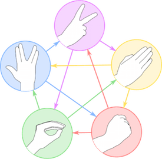
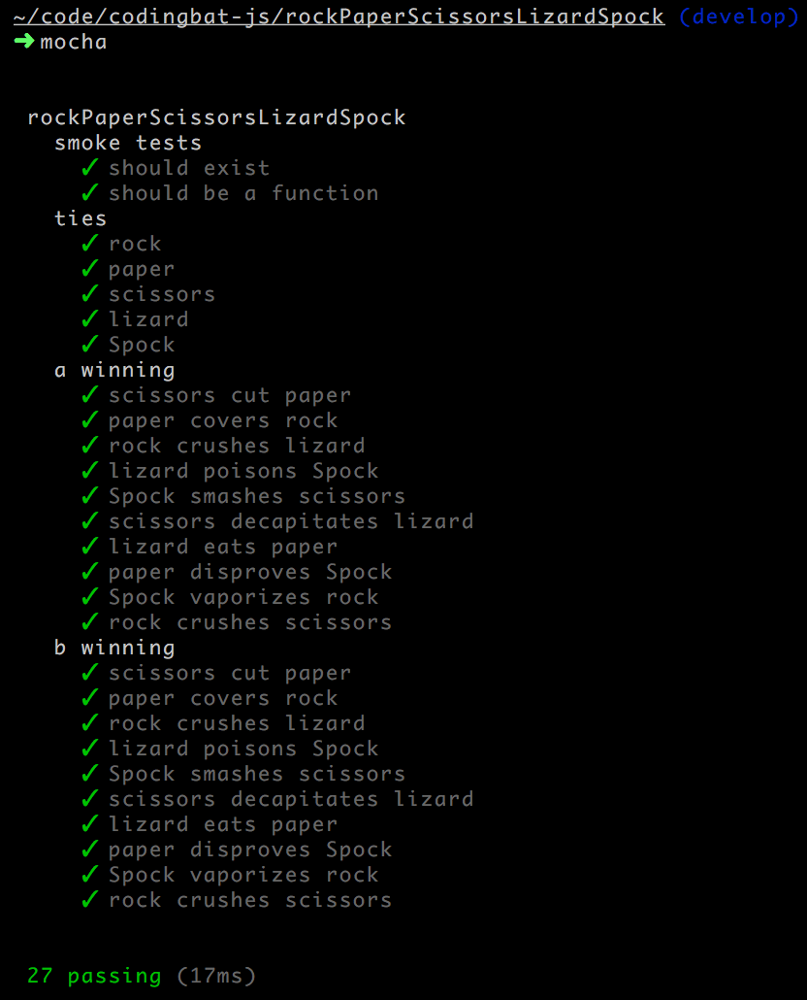

# rockPaperScissorsLizardSpock

_Image by Wikipedia user Nojhan (CC BY-SA)_
_[https://en.wikipedia.org/wiki/rock-paper-scissors-lizard-spock](https://en.wikipedia.org/wiki/rock-paper-scissors-lizard-spock)_

### Game Rules
In the game of rock-paper-scissors-lizard-Spock, players A and B simultaneously reveal a choice of
rock, paper, scissors, lizard, or Spock.

* scissors cut paper
* paper covers rock
* rock crushes lizard
* lizard poisons Spock
* Spock smashes scissors
* scissors decapitates lizard
* lizard eats paper
* paper disproves Spock
* Spock vaporizes rock
* rock crushes scissors

It is a tie if both players play the same thing.

### Write a Function
Write a function `rockPaperScissorsLizardSpock(a, b)`, where `a` and `b` are the player's moves,
which must be `'rock'` or `'paper'` or `'scissors'` or `'lizard'` or `'Spock'`.

Return `1` if player A wins, `-1` if player B wins, and `0` if it is a tie.

_Adapted from
[http://codingbat.com/prob/p270750](http://codingbat.com/prob/p270750)_

### Unit Tests

